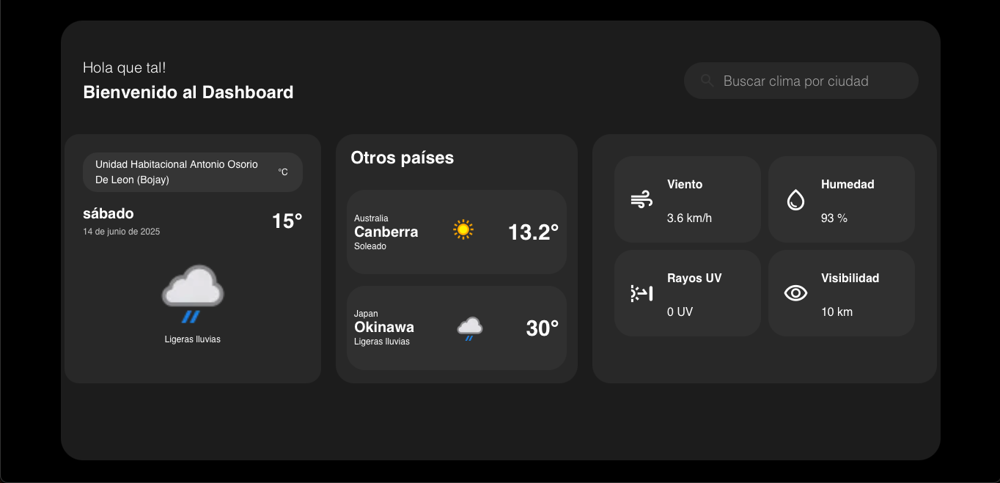

# 🌤️ Dashboard Weather

Una aplicación de clima moderna y responsiva que permite consultar el estado del tiempo actual de cualquier ciudad del mundo, utilizando la **API de WeatherAPI**. Diseñada con un enfoque modular y atractiva visualmente, esta aplicación ofrece una experiencia fluida tanto en dispositivos de escritorio como móviles.

## 🚀 Características principales

- 🔍 **Búsqueda por ciudad:** Permite al usuario ingresar el nombre de cualquier ciudad para consultar el clima actual.
- 📍 **Ubicación automática:** Integra la **geolocalización del navegador** para mostrar el clima del lugar donde se encuentra el usuario al iniciar la app.
- 🌐 **WeatherAPI integrada:** Usa [WeatherAPI](https://www.weatherapi.com/) para obtener datos actualizados del clima.
- 💡 **Desarrollo asistido por IA:** Utilicé herramientas de inteligencia artificial (ChatGPT) para mejorar la calidad del código, optimizar lógica y acelerar el desarrollo.
- 🧩 **Componentes reutilizables:** El diseño de componentes independientes (como `WeatherCard`, `WeatherContainer`, `Search`, etc.) facilita la **escalabilidad** y el mantenimiento del proyecto.
- 🎨 **Diseño moderno y responsivo:** Interfaz limpia y adaptable a distintas resoluciones de pantalla, optimizada para móviles y escritorios.
- ✅ **Manejo de errores amigable:** Se notifica al usuario cuando una ciudad no es válida.

---

## 🧑‍💻 Tecnologías utilizadas

- ⚛️ React (Vite)
- 🌤️ [WeatherAPI](https://www.weatherapi.com/)
- 🧠 ChatGPT (asistencia en desarrollo)
- 🧪 (Planeado) React Testing Library + Vitest
- 🎨 CSS personalizado

---

## 🧱 Estructura del proyecto
Dashboard-Weather/
├── Components/
│ ├── WeatherCard.tsx
│ ├── WeatherContainer.tsx
│ ├── OtherCountries.tsx
│ └── Search.tsx
├── App.tsx
├── index.css
├── main.tsx
├── ...


---

## 🗺️ Cómo funciona la geolocalización

Al cargar la app, si el navegador lo permite, se obtiene automáticamente la latitud y longitud del usuario mediante la API de Geolocation, y se hace una consulta directa a WeatherAPI para obtener el clima actual del lugar.

En caso de que el usuario no otorgue permisos, la app carga por defecto el clima de *San Andrés Cholula*.

---

## 🔧 Cómo ejecutar el proyecto localmente

1. Clona el repositorio:

   ```bash
   git clone https://github.com/RodEsB/Dashboard-Weather.git
   cd Dashboard-Weather


2. Instala las dependencias:

   ```bash
   npm install


3. Ejecuta el proyecto:
  
    ```bash
    npm run dev


## 📦 Dependencias clave

- `react`
- `vite`
- `@types/react`
- `@vitejs/plugin-react`

---

## 📌 Nota sobre la API

> Este proyecto utiliza una **API key personal** gratuita de [WeatherAPI](https://www.weatherapi.com/). Se recomienda crear tu propia cuenta gratuita para uso personal o en producción.

---

## 🤖 Rol de la Inteligencia Artificial

Durante el desarrollo, se utilizó **ChatGPT** como asistente técnico para:

- Depurar errores y mejorar el manejo de errores.
- Refinar el diseño responsivo con buenas prácticas de UI.

---

## 📱 Vista previa

| Escritorio | Móvil |
|-----------|--------|
|  |  |


---

## 📜 Licencia

Este proyecto es de código abierto y está disponible bajo la licencia [MIT](LICENSE).

---

## 🤓 Autor

**Rodrigo Espíritu Berra**  
📍 San Andrés Cholula, Puebla, México  
💼 Ingeniería en Sistemas Computacionales  
🔗 [LinkedIn](https://www.linkedin.com/in/rodrigo-espíritu-berra/) • [GitHub](https://github.com/RodEsB)